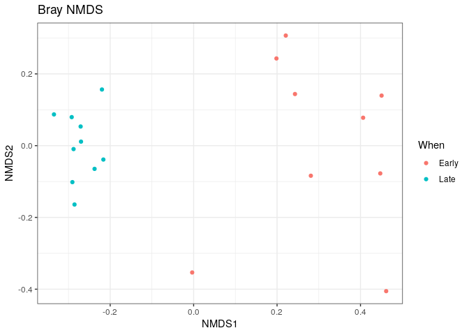

DADA2 Tuto nb
================

## Installer et faire apparaitre en tête le package DADA2.

``` r
install.packages("Rcpp")
```

    ## Installing package into '/usr/local/lib/R/site-library'
    ## (as 'lib' is unspecified)

``` r
library(dada2)
```

    ## Loading required package: Rcpp

``` r
packageVersion("dada2")
```

    ## [1] '1.28.0'

Ici, on cherche à créer le vecteur path qui contiendra l’ensemble des
fichiers de séquence sur lesquels travailler.

``` r
path<- "/home/rstudio/DADA2/MiSeq_SOP"
print(path)
```

    ## [1] "/home/rstudio/DADA2/MiSeq_SOP"

``` r
list.files(path)
```

    ##  [1] "F3D0_S188_L001_R1_001.fastq"   "F3D0_S188_L001_R2_001.fastq"  
    ##  [3] "F3D1_S189_L001_R1_001.fastq"   "F3D1_S189_L001_R2_001.fastq"  
    ##  [5] "F3D141_S207_L001_R1_001.fastq" "F3D141_S207_L001_R2_001.fastq"
    ##  [7] "F3D142_S208_L001_R1_001.fastq" "F3D142_S208_L001_R2_001.fastq"
    ##  [9] "F3D143_S209_L001_R1_001.fastq" "F3D143_S209_L001_R2_001.fastq"
    ## [11] "F3D144_S210_L001_R1_001.fastq" "F3D144_S210_L001_R2_001.fastq"
    ## [13] "F3D145_S211_L001_R1_001.fastq" "F3D145_S211_L001_R2_001.fastq"
    ## [15] "F3D146_S212_L001_R1_001.fastq" "F3D146_S212_L001_R2_001.fastq"
    ## [17] "F3D147_S213_L001_R1_001.fastq" "F3D147_S213_L001_R2_001.fastq"
    ## [19] "F3D148_S214_L001_R1_001.fastq" "F3D148_S214_L001_R2_001.fastq"
    ## [21] "F3D149_S215_L001_R1_001.fastq" "F3D149_S215_L001_R2_001.fastq"
    ## [23] "F3D150_S216_L001_R1_001.fastq" "F3D150_S216_L001_R2_001.fastq"
    ## [25] "F3D2_S190_L001_R1_001.fastq"   "F3D2_S190_L001_R2_001.fastq"  
    ## [27] "F3D3_S191_L001_R1_001.fastq"   "F3D3_S191_L001_R2_001.fastq"  
    ## [29] "F3D5_S193_L001_R1_001.fastq"   "F3D5_S193_L001_R2_001.fastq"  
    ## [31] "F3D6_S194_L001_R1_001.fastq"   "F3D6_S194_L001_R2_001.fastq"  
    ## [33] "F3D7_S195_L001_R1_001.fastq"   "F3D7_S195_L001_R2_001.fastq"  
    ## [35] "F3D8_S196_L001_R1_001.fastq"   "F3D8_S196_L001_R2_001.fastq"  
    ## [37] "F3D9_S197_L001_R1_001.fastq"   "F3D9_S197_L001_R2_001.fastq"  
    ## [39] "filtered"                      "HMP_MOCK.v35.fasta"           
    ## [41] "Mock_S280_L001_R1_001.fastq"   "Mock_S280_L001_R2_001.fastq"  
    ## [43] "mouse.dpw.metadata"            "mouse.time.design"            
    ## [45] "stability.batch"               "stability.files"

Dans deux vecteurs différents, on assigne respectivement l’ensemble des
sequences forward (fnFs) et reverse (fnRs).

``` r
fnFs<-sort(list.files(path, pattern="_R1_001.fastq", full.names=TRUE))
print(fnFs)
```

    ##  [1] "/home/rstudio/DADA2/MiSeq_SOP/F3D0_S188_L001_R1_001.fastq"  
    ##  [2] "/home/rstudio/DADA2/MiSeq_SOP/F3D1_S189_L001_R1_001.fastq"  
    ##  [3] "/home/rstudio/DADA2/MiSeq_SOP/F3D141_S207_L001_R1_001.fastq"
    ##  [4] "/home/rstudio/DADA2/MiSeq_SOP/F3D142_S208_L001_R1_001.fastq"
    ##  [5] "/home/rstudio/DADA2/MiSeq_SOP/F3D143_S209_L001_R1_001.fastq"
    ##  [6] "/home/rstudio/DADA2/MiSeq_SOP/F3D144_S210_L001_R1_001.fastq"
    ##  [7] "/home/rstudio/DADA2/MiSeq_SOP/F3D145_S211_L001_R1_001.fastq"
    ##  [8] "/home/rstudio/DADA2/MiSeq_SOP/F3D146_S212_L001_R1_001.fastq"
    ##  [9] "/home/rstudio/DADA2/MiSeq_SOP/F3D147_S213_L001_R1_001.fastq"
    ## [10] "/home/rstudio/DADA2/MiSeq_SOP/F3D148_S214_L001_R1_001.fastq"
    ## [11] "/home/rstudio/DADA2/MiSeq_SOP/F3D149_S215_L001_R1_001.fastq"
    ## [12] "/home/rstudio/DADA2/MiSeq_SOP/F3D150_S216_L001_R1_001.fastq"
    ## [13] "/home/rstudio/DADA2/MiSeq_SOP/F3D2_S190_L001_R1_001.fastq"  
    ## [14] "/home/rstudio/DADA2/MiSeq_SOP/F3D3_S191_L001_R1_001.fastq"  
    ## [15] "/home/rstudio/DADA2/MiSeq_SOP/F3D5_S193_L001_R1_001.fastq"  
    ## [16] "/home/rstudio/DADA2/MiSeq_SOP/F3D6_S194_L001_R1_001.fastq"  
    ## [17] "/home/rstudio/DADA2/MiSeq_SOP/F3D7_S195_L001_R1_001.fastq"  
    ## [18] "/home/rstudio/DADA2/MiSeq_SOP/F3D8_S196_L001_R1_001.fastq"  
    ## [19] "/home/rstudio/DADA2/MiSeq_SOP/F3D9_S197_L001_R1_001.fastq"  
    ## [20] "/home/rstudio/DADA2/MiSeq_SOP/Mock_S280_L001_R1_001.fastq"

``` r
fnRs<-sort(list.files(path, pattern="_R2_001.fastq",full.names=TRUE))
print(fnRs)
```

    ##  [1] "/home/rstudio/DADA2/MiSeq_SOP/F3D0_S188_L001_R2_001.fastq"  
    ##  [2] "/home/rstudio/DADA2/MiSeq_SOP/F3D1_S189_L001_R2_001.fastq"  
    ##  [3] "/home/rstudio/DADA2/MiSeq_SOP/F3D141_S207_L001_R2_001.fastq"
    ##  [4] "/home/rstudio/DADA2/MiSeq_SOP/F3D142_S208_L001_R2_001.fastq"
    ##  [5] "/home/rstudio/DADA2/MiSeq_SOP/F3D143_S209_L001_R2_001.fastq"
    ##  [6] "/home/rstudio/DADA2/MiSeq_SOP/F3D144_S210_L001_R2_001.fastq"
    ##  [7] "/home/rstudio/DADA2/MiSeq_SOP/F3D145_S211_L001_R2_001.fastq"
    ##  [8] "/home/rstudio/DADA2/MiSeq_SOP/F3D146_S212_L001_R2_001.fastq"
    ##  [9] "/home/rstudio/DADA2/MiSeq_SOP/F3D147_S213_L001_R2_001.fastq"
    ## [10] "/home/rstudio/DADA2/MiSeq_SOP/F3D148_S214_L001_R2_001.fastq"
    ## [11] "/home/rstudio/DADA2/MiSeq_SOP/F3D149_S215_L001_R2_001.fastq"
    ## [12] "/home/rstudio/DADA2/MiSeq_SOP/F3D150_S216_L001_R2_001.fastq"
    ## [13] "/home/rstudio/DADA2/MiSeq_SOP/F3D2_S190_L001_R2_001.fastq"  
    ## [14] "/home/rstudio/DADA2/MiSeq_SOP/F3D3_S191_L001_R2_001.fastq"  
    ## [15] "/home/rstudio/DADA2/MiSeq_SOP/F3D5_S193_L001_R2_001.fastq"  
    ## [16] "/home/rstudio/DADA2/MiSeq_SOP/F3D6_S194_L001_R2_001.fastq"  
    ## [17] "/home/rstudio/DADA2/MiSeq_SOP/F3D7_S195_L001_R2_001.fastq"  
    ## [18] "/home/rstudio/DADA2/MiSeq_SOP/F3D8_S196_L001_R2_001.fastq"  
    ## [19] "/home/rstudio/DADA2/MiSeq_SOP/F3D9_S197_L001_R2_001.fastq"  
    ## [20] "/home/rstudio/DADA2/MiSeq_SOP/Mock_S280_L001_R2_001.fastq"

Le vecteur “sample.names” sera défini comme les noms des échantillons
selon la première partie du nom de fichier si on considère le caractère
“\_” comme séparateur. Ainsi on a : F3D0_s188_L001_R1_001.fastq aura le
nom F3D0.

``` r
sample.names<-sapply(strsplit(basename(fnFs),"_"),`[`, 1)
sample.names
```

    ##  [1] "F3D0"   "F3D1"   "F3D141" "F3D142" "F3D143" "F3D144" "F3D145" "F3D146"
    ##  [9] "F3D147" "F3D148" "F3D149" "F3D150" "F3D2"   "F3D3"   "F3D5"   "F3D6"  
    ## [17] "F3D7"   "F3D8"   "F3D9"   "Mock"

## Profil de qualité des séquences

Ces graphiques présente les scores de qualité pour l’ensemble des bases
des séquences 1 et 2 Forward et reverse.

``` r
plotQualityProfile(fnFs[1:2])
```

<!-- -->

``` r
plotQualityProfile(fnRs[1:2])
```

<!-- -->

# Filtrer les séquences.

L’objectif de cette partie est de supprimer les séquences de mauvaise
qualité identifiées grâce aux graphiques précedents. On créé donc deux
nouveaux vecteurs de séquences filtrées (filtF/Rs) en y assignant le
chemin pour aller jusqu’aux fichiers de séquences dans le dossier
“filtered” et assignant comme nom d’échantillons les noms utiliser dans
la variable “sample.names” suivi de la précision “\_f/R_filt.fastq.gz”
pour identifier les séquences filtrées.

``` r
filtFs<-file.path(path,"filtered",paste0(sample.names,"_F_filt.fastq.gz"))
filtRs<-file.path(path,"filtered",paste0(sample.names,"_R_filt.fastq.gz"))
```

La fonction suivante permettra de réunir dans un seul vecteur les
parametres de filtre. Ainsi pour les fichier fnF/Rs et filtF/Rs, on va
couper les séquences après 240pb pour les seq F, et 160pb pour les seq
R, qui permet toujours un chevauchement des 2 séquences pour les aligner
tout en éliminant les pb de mauvaises qualité aux extrémités des
séquences. MaxN/EE et truncQ sont des valeurs standards, rm.phix permet
de supprimer les séquences du gène phagique phi X ajouter avant
séquençage.

``` r
out<-filterAndTrim(fnFs, filtFs, fnRs, filtRs, truncLen=c(240,160),maxN=0,maxEE=c(2,2),truncQ=2,rm.phix=TRUE,compress=TRUE,multithread=TRUE)
```

La fonction “head” permet de comparé le nombre de séquence avant et
après filtration des séquences.

``` r
head(out)
```

    ##                               reads.in reads.out
    ## F3D0_S188_L001_R1_001.fastq       7793      7113
    ## F3D1_S189_L001_R1_001.fastq       5869      5299
    ## F3D141_S207_L001_R1_001.fastq     5958      5463
    ## F3D142_S208_L001_R1_001.fastq     3183      2914
    ## F3D143_S209_L001_R1_001.fastq     3178      2941
    ## F3D144_S210_L001_R1_001.fastq     4827      4312

## Apprendre les erreurs.

Le but de ce vecteur est d’évaluer les taux d’erreurs de séquençage. On
assigne aux deux fonctions suivantes d’apprendre des erreurs sur les
séquences F et R.

``` r
errF<-learnErrors(filtFs, multithread=TRUE)
```

    ## 33514080 total bases in 139642 reads from 20 samples will be used for learning the error rates.

``` r
errR<-learnErrors(filtRs, multithread=TRUE)
```

    ## 22342720 total bases in 139642 reads from 20 samples will be used for learning the error rates.

Cela permet par la suite d’établir des graphiques d’estimation du taux
d’erreur en fonction de la base à partir du jeu de données.

``` r
plotErrors(errF,nominalQ=TRUE)
```

    ## Warning: Transformation introduced infinite values in continuous y-axis
    ## Transformation introduced infinite values in continuous y-axis

<!-- -->

# Sample Inference

Cette étape permet d’identifier les séquences uniques parmis l’ensemble
des échantillons.

Le vecteur dadaF/Rs sera assigné par la fonction dada qui permet de
supprimer les erreurs de séquençage des fichier de séquences filtrées en
applicant le taux d’erreur appris précédemment.

``` r
dadaFs<-dada(filtFs, err=errF, multithread=TRUE)
```

    ## Sample 1 - 7113 reads in 1979 unique sequences.
    ## Sample 2 - 5299 reads in 1639 unique sequences.
    ## Sample 3 - 5463 reads in 1477 unique sequences.
    ## Sample 4 - 2914 reads in 904 unique sequences.
    ## Sample 5 - 2941 reads in 939 unique sequences.
    ## Sample 6 - 4312 reads in 1267 unique sequences.
    ## Sample 7 - 6741 reads in 1756 unique sequences.
    ## Sample 8 - 4560 reads in 1438 unique sequences.
    ## Sample 9 - 15637 reads in 3590 unique sequences.
    ## Sample 10 - 11413 reads in 2762 unique sequences.
    ## Sample 11 - 12017 reads in 3021 unique sequences.
    ## Sample 12 - 5032 reads in 1566 unique sequences.
    ## Sample 13 - 18075 reads in 3707 unique sequences.
    ## Sample 14 - 6250 reads in 1479 unique sequences.
    ## Sample 15 - 4052 reads in 1195 unique sequences.
    ## Sample 16 - 7369 reads in 1832 unique sequences.
    ## Sample 17 - 4765 reads in 1183 unique sequences.
    ## Sample 18 - 4871 reads in 1382 unique sequences.
    ## Sample 19 - 6504 reads in 1709 unique sequences.
    ## Sample 20 - 4314 reads in 897 unique sequences.

``` r
dadaRs<-dada(filtRs, err=errR, multithread=TRUE)
```

    ## Sample 1 - 7113 reads in 1660 unique sequences.
    ## Sample 2 - 5299 reads in 1349 unique sequences.
    ## Sample 3 - 5463 reads in 1335 unique sequences.
    ## Sample 4 - 2914 reads in 853 unique sequences.
    ## Sample 5 - 2941 reads in 880 unique sequences.
    ## Sample 6 - 4312 reads in 1286 unique sequences.
    ## Sample 7 - 6741 reads in 1803 unique sequences.
    ## Sample 8 - 4560 reads in 1265 unique sequences.
    ## Sample 9 - 15637 reads in 3414 unique sequences.
    ## Sample 10 - 11413 reads in 2522 unique sequences.
    ## Sample 11 - 12017 reads in 2771 unique sequences.
    ## Sample 12 - 5032 reads in 1415 unique sequences.
    ## Sample 13 - 18075 reads in 3290 unique sequences.
    ## Sample 14 - 6250 reads in 1390 unique sequences.
    ## Sample 15 - 4052 reads in 1134 unique sequences.
    ## Sample 16 - 7369 reads in 1635 unique sequences.
    ## Sample 17 - 4765 reads in 1084 unique sequences.
    ## Sample 18 - 4871 reads in 1161 unique sequences.
    ## Sample 19 - 6504 reads in 1502 unique sequences.
    ## Sample 20 - 4314 reads in 732 unique sequences.

La fonction suivante permet d’afficher le nombre de séquences uniques
identifiées ainsi que le nombre de variants identifiés parmis ces
séquences uniques pour un échantillon.

``` r
dadaFs[[16]]
```

    ## dada-class: object describing DADA2 denoising results
    ## 121 sequence variants were inferred from 1832 input unique sequences.
    ## Key parameters: OMEGA_A = 1e-40, OMEGA_C = 1e-40, BAND_SIZE = 16

## Rassembler les séquences.

Ici, la fonction mergePairs est assigné au vecteur mergers dans le but
de rassembler l’ensemble des séquences dans un tableau et de les
comparés.

``` r
mergers<-mergePairs(dadaFs,filtFs,dadaRs,filtRs, verbose=TRUE)
```

    ## 6540 paired-reads (in 107 unique pairings) successfully merged out of 6891 (in 197 pairings) input.

    ## 5028 paired-reads (in 101 unique pairings) successfully merged out of 5190 (in 157 pairings) input.

    ## 4986 paired-reads (in 81 unique pairings) successfully merged out of 5267 (in 166 pairings) input.

    ## 2595 paired-reads (in 52 unique pairings) successfully merged out of 2754 (in 108 pairings) input.

    ## 2553 paired-reads (in 60 unique pairings) successfully merged out of 2785 (in 119 pairings) input.

    ## 3646 paired-reads (in 55 unique pairings) successfully merged out of 4109 (in 157 pairings) input.

    ## 6079 paired-reads (in 81 unique pairings) successfully merged out of 6514 (in 198 pairings) input.

    ## 3968 paired-reads (in 91 unique pairings) successfully merged out of 4388 (in 187 pairings) input.

    ## 14233 paired-reads (in 143 unique pairings) successfully merged out of 15355 (in 352 pairings) input.

    ## 10528 paired-reads (in 120 unique pairings) successfully merged out of 11165 (in 278 pairings) input.

    ## 11154 paired-reads (in 137 unique pairings) successfully merged out of 11797 (in 298 pairings) input.

    ## 4349 paired-reads (in 85 unique pairings) successfully merged out of 4802 (in 179 pairings) input.

    ## 17431 paired-reads (in 153 unique pairings) successfully merged out of 17812 (in 272 pairings) input.

    ## 5850 paired-reads (in 81 unique pairings) successfully merged out of 6095 (in 159 pairings) input.

    ## 3716 paired-reads (in 86 unique pairings) successfully merged out of 3894 (in 147 pairings) input.

    ## 6865 paired-reads (in 99 unique pairings) successfully merged out of 7191 (in 187 pairings) input.

    ## 4426 paired-reads (in 67 unique pairings) successfully merged out of 4603 (in 127 pairings) input.

    ## 4576 paired-reads (in 101 unique pairings) successfully merged out of 4739 (in 174 pairings) input.

    ## 6092 paired-reads (in 109 unique pairings) successfully merged out of 6315 (in 173 pairings) input.

    ## 4269 paired-reads (in 20 unique pairings) successfully merged out of 4281 (in 28 pairings) input.

``` r
head(mergers[[1]])
```

    ##                                                                                                                                                                                                                                                       sequence
    ## 1 TACGGAGGATGCGAGCGTTATCCGGATTTATTGGGTTTAAAGGGTGCGCAGGCGGAAGATCAAGTCAGCGGTAAAATTGAGAGGCTCAACCTCTTCGAGCCGTTGAAACTGGTTTTCTTGAGTGAGCGAGAAGTATGCGGAATGCGTGGTGTAGCGGTGAAATGCATAGATATCACGCAGAACTCCGATTGCGAAGGCAGCATACCGGCGCTCAACTGACGCTCATGCACGAAAGTGTGGGTATCGAACAGG
    ## 2 TACGGAGGATGCGAGCGTTATCCGGATTTATTGGGTTTAAAGGGTGCGTAGGCGGCCTGCCAAGTCAGCGGTAAAATTGCGGGGCTCAACCCCGTACAGCCGTTGAAACTGCCGGGCTCGAGTGGGCGAGAAGTATGCGGAATGCGTGGTGTAGCGGTGAAATGCATAGATATCACGCAGAACCCCGATTGCGAAGGCAGCATACCGGCGCCCTACTGACGCTGAGGCACGAAAGTGCGGGGATCAAACAGG
    ## 3 TACGGAGGATGCGAGCGTTATCCGGATTTATTGGGTTTAAAGGGTGCGTAGGCGGGCTGTTAAGTCAGCGGTCAAATGTCGGGGCTCAACCCCGGCCTGCCGTTGAAACTGGCGGCCTCGAGTGGGCGAGAAGTATGCGGAATGCGTGGTGTAGCGGTGAAATGCATAGATATCACGCAGAACTCCGATTGCGAAGGCAGCATACCGGCGCCCGACTGACGCTGAGGCACGAAAGCGTGGGTATCGAACAGG
    ## 4 TACGGAGGATGCGAGCGTTATCCGGATTTATTGGGTTTAAAGGGTGCGTAGGCGGGCTTTTAAGTCAGCGGTAAAAATTCGGGGCTCAACCCCGTCCGGCCGTTGAAACTGGGGGCCTTGAGTGGGCGAGAAGAAGGCGGAATGCGTGGTGTAGCGGTGAAATGCATAGATATCACGCAGAACCCCGATTGCGAAGGCAGCCTTCCGGCGCCCTACTGACGCTGAGGCACGAAAGTGCGGGGATCGAACAGG
    ## 5 TACGGAGGATGCGAGCGTTATCCGGATTTATTGGGTTTAAAGGGTGCGCAGGCGGACTCTCAAGTCAGCGGTCAAATCGCGGGGCTCAACCCCGTTCCGCCGTTGAAACTGGGAGCCTTGAGTGCGCGAGAAGTAGGCGGAATGCGTGGTGTAGCGGTGAAATGCATAGATATCACGCAGAACTCCGATTGCGAAGGCAGCCTACCGGCGCGCAACTGACGCTCATGCACGAAAGCGTGGGTATCGAACAGG
    ## 6 TACGGAGGATGCGAGCGTTATCCGGATTTATTGGGTTTAAAGGGTGCGTAGGCGGGATGCCAAGTCAGCGGTAAAAAAGCGGTGCTCAACGCCGTCGAGCCGTTGAAACTGGCGTTCTTGAGTGGGCGAGAAGTATGCGGAATGCGTGGTGTAGCGGTGAAATGCATAGATATCACGCAGAACTCCGATTGCGAAGGCAGCATACCGGCGCCCTACTGACGCTGAGGCACGAAAGCGTGGGTATCGAACAGG
    ##   abundance forward reverse nmatch nmismatch nindel prefer accept
    ## 1       579       1       1    148         0      0      1   TRUE
    ## 2       470       2       2    148         0      0      2   TRUE
    ## 3       449       3       4    148         0      0      1   TRUE
    ## 4       430       4       3    148         0      0      2   TRUE
    ## 5       345       5       6    148         0      0      1   TRUE
    ## 6       282       6       5    148         0      0      2   TRUE

## Construction de la table de séquence.

Les lignes de commandes suivantes permettent de réaliser un tableau de
séquences décrivant le nombre de lignes et de colonnes (dim) et la
distributions des longueurs des séquences.

``` r
seqtab<-makeSequenceTable(mergers)
dim(seqtab)
```

    ## [1]  20 293

``` r
table(nchar(getSequences(seqtab)))
```

    ## 
    ## 251 252 253 254 255 
    ##   1  88 196   6   2

## Suppression des séquences chimères.

L’objectif de ces fonctions est d’assigner au tableau “seqtab.nochim”
l’ensemble des séquences considérées comme non-chimériques par
comparaison de l’ensemble des séquences du séquençage effectué et d’en
décrire le nombre de ligne et de colonne.

``` r
seqtab.nochim <- removeBimeraDenovo(seqtab, method="consensus", multithread=TRUE, verbose=TRUE)
```

    ## Identified 61 bimeras out of 293 input sequences.

``` r
dim(seqtab.nochim)
```

    ## [1]  20 232

``` r
sum(seqtab.nochim)/sum(seqtab)
```

    ## [1] 0.9640374

## Résumé du nombre de séquences à chacune des étapes.

Les fonctions suivantes permettent de présenter un tableau présentant le
nombre de séquences retenues à chaque étape (données brutes, filtration,
suppression des chimères, …)

``` r
getN <- function(x) sum(getUniques(x))
track <- cbind(out, sapply(dadaFs, getN), sapply(dadaRs, getN), sapply(mergers, getN), rowSums(seqtab.nochim))
colnames(track) <- c("input", "filtered", "denoisedF", "denoisedR", "merged", "nonchim")
rownames(track) <- sample.names
head(track)
```

    ##        input filtered denoisedF denoisedR merged nonchim
    ## F3D0    7793     7113      6976      6979   6540    6528
    ## F3D1    5869     5299      5227      5239   5028    5017
    ## F3D141  5958     5463      5331      5357   4986    4863
    ## F3D142  3183     2914      2799      2830   2595    2521
    ## F3D143  3178     2941      2822      2868   2553    2519
    ## F3D144  4827     4312      4151      4228   3646    3507

## Assignement des taxonomies.

Grâce à la base de données Silva v132, il est possible d’assigner des
taxonomies aux séquences retenues. Ces taxonomies sont assignées au
vecteur “Taxa” à partir de la table de séquences non chimériques.

``` r
taxa <- assignTaxonomy(seqtab.nochim, "~/DADA2/silva_nr_v132_train_set.fa.gz", multithread=TRUE)
```

Cela permet par la suite d’identifier et de présenter dans une table le
taxon retrouvés dans les échantillons.

``` r
taxa.print<-taxa
rownames(taxa.print)<-NULL
head(taxa.print)
```

    ##      Kingdom    Phylum          Class         Order           Family          
    ## [1,] "Bacteria" "Bacteroidetes" "Bacteroidia" "Bacteroidales" "Muribaculaceae"
    ## [2,] "Bacteria" "Bacteroidetes" "Bacteroidia" "Bacteroidales" "Muribaculaceae"
    ## [3,] "Bacteria" "Bacteroidetes" "Bacteroidia" "Bacteroidales" "Muribaculaceae"
    ## [4,] "Bacteria" "Bacteroidetes" "Bacteroidia" "Bacteroidales" "Muribaculaceae"
    ## [5,] "Bacteria" "Bacteroidetes" "Bacteroidia" "Bacteroidales" "Bacteroidaceae"
    ## [6,] "Bacteria" "Bacteroidetes" "Bacteroidia" "Bacteroidales" "Muribaculaceae"
    ##      Genus        
    ## [1,] NA           
    ## [2,] NA           
    ## [3,] NA           
    ## [4,] NA           
    ## [5,] "Bacteroides"
    ## [6,] NA

## Evaluer la précision.

Afin d’évaluer la précision, il faut utiliser l’échantillon Mock ajouté
à composition et concentration connue, dont on ajoute les séquences à
partir de la table seqtab.nochim au vecteur unqs.mock. Par la suite, on
trie les séquences (sort) du vecteur unqs.mock suivant la longueur des
séquences qu’il contient. La fonction “cat” permet d’afficher le
résultat du nombre de séquences de l’échantillon Mock.

``` r
unqs.mock<-seqtab.nochim["Mock_F_filt.fastq.gz",]

unqs.mock <- sort(unqs.mock[unqs.mock>0], decreasing=TRUE)

cat("DADA2 inferred", length(unqs.mock), "sample sequences present in the Mock community.\n")
```

    ## DADA2 inferred 20 sample sequences present in the Mock community.

On créé par la suite un vecteur de référence de l’échantillon Mock avec
le fichier contenant l’ensemble des séquences qui doivent être
retrouvées (HMP_MOCK.v35.fasta). La fonction match.ref permet de
comparer l’échantillon de référence Mock (mock.ref) avec l’échantillon
mock séquencé. La fonction “cat” permet d’afficher la somme des
séquences de l’échantillon Mock concordante avec l’échantillon de
reférence (mock.ref).

``` r
mock.ref<-getSequences(file.path(path, "HMP_MOCK.v35.fasta"))

match.ref<-sum(sapply(names(unqs.mock), function(x) any(grepl(x, mock.ref))))

cat("Of those,", sum(match.ref), "were exact matches to the expected reference sequences.\n")
```

    ## Of those, 20 were exact matches to the expected reference sequences.

## Utilisation de Phyloseq.

``` r
library(phyloseq)
library(Biostrings)
```

    ## Loading required package: BiocGenerics

    ## 
    ## Attaching package: 'BiocGenerics'

    ## The following objects are masked from 'package:stats':
    ## 
    ##     IQR, mad, sd, var, xtabs

    ## The following objects are masked from 'package:base':
    ## 
    ##     anyDuplicated, aperm, append, as.data.frame, basename, cbind,
    ##     colnames, dirname, do.call, duplicated, eval, evalq, Filter, Find,
    ##     get, grep, grepl, intersect, is.unsorted, lapply, Map, mapply,
    ##     match, mget, order, paste, pmax, pmax.int, pmin, pmin.int,
    ##     Position, rank, rbind, Reduce, rownames, sapply, setdiff, sort,
    ##     table, tapply, union, unique, unsplit, which.max, which.min

    ## Loading required package: S4Vectors

    ## Loading required package: stats4

    ## 
    ## Attaching package: 'S4Vectors'

    ## The following object is masked from 'package:utils':
    ## 
    ##     findMatches

    ## The following objects are masked from 'package:base':
    ## 
    ##     expand.grid, I, unname

    ## Loading required package: IRanges

    ## 
    ## Attaching package: 'IRanges'

    ## The following object is masked from 'package:phyloseq':
    ## 
    ##     distance

    ## Loading required package: XVector

    ## Loading required package: GenomeInfoDb

    ## 
    ## Attaching package: 'Biostrings'

    ## The following object is masked from 'package:base':
    ## 
    ##     strsplit

``` r
library(ggplot2)
theme_set(theme_bw())
```

## Construction d’un tableau de données.

Ici, il faut créer un tableau de données présentant le nom, le genre, et
le jour de chacun des échantillons.

``` r
samples.out <- rownames(seqtab.nochim)

subject <- sapply(strsplit(samples.out, "D"), `[`, 1)

gender <- substr(subject,1,1)

subject <- substr(subject,2,999)

day <- as.integer(sapply(strsplit(sample.names, "D"), `[`, 2))

samdf <- data.frame(Subject=subject, Gender=gender, Day=day)

samdf$When <- "Early"

samdf$When[samdf$Day>100] <- "Late"

rownames(samdf) <- samples.out
```

Par la suite, il faut créer une table d’OTU grâce aux séquences qui sera
enregistré dans un dossier phyloseq de stockage. On supprime aussi les
séquences de l’échantillon Mock afin de réaliser des analyses seulement
sur les échantillons de composition inconnue.

``` r
ps<-phyloseq(otu_table(seqtab.nochim, taxa_are_rows=FALSE), 
               sample_data(samdf), 
               tax_table(taxa))

ps<-prune_samples(sample_names(ps) !="Mock_F_filt.fastq.gz",ps)
ps
```

    ## phyloseq-class experiment-level object
    ## otu_table()   OTU Table:         [ 232 taxa and 19 samples ]
    ## sample_data() Sample Data:       [ 19 samples by 4 sample variables ]
    ## tax_table()   Taxonomy Table:    [ 232 taxa by 6 taxonomic ranks ]

Les commandes usivantes servent à raccourcir le nom des séquences pour
faciliter l’interprétation. Il faudra donc stocker les séquences dans un
dossier (ici “dna”) dotn les noms seront les mêmes que ceux utilisé dans
la table d’OTU (ce seront les séquences entières). On assignera à ps un
nom court pour chaque séquence grâce à la fonction merge_phyloseq
(correspondance des noms/séquences entre ps et dna). Les noms
taxonomiques de ps seront des séquences générées en fonction des
taxonomies assignées à ps.

``` r
dna<-Biostrings::DNAStringSet(taxa_names(ps))

names(dna) <- taxa_names(ps)
 
ps <- merge_phyloseq(ps, dna)

taxa_names(ps) <- paste0("ASV", seq(ntaxa(ps)))

print(ps)
```

    ## phyloseq-class experiment-level object
    ## otu_table()   OTU Table:         [ 232 taxa and 19 samples ]
    ## sample_data() Sample Data:       [ 19 samples by 4 sample variables ]
    ## tax_table()   Taxonomy Table:    [ 232 taxa by 6 taxonomic ranks ]
    ## refseq()      DNAStringSet:      [ 232 reference sequences ]

## Analyse des différences entre les échantillons prélevés à t\<100jours VS t\>100jours.

Les graphiques suivant décrivent la diversité alpha des communautés en
fonction du jour ou à été prélevé l’échantillon (\<100 jours VS \>100
jours). On distingue une plus faible diversité des communautés dans les
échantillons prélevés à t\>100jours mais ces communautés reste plus
similaires que celles à t\<100jours qui restent différentes (points
éparpillés).

``` r
plot_richness(ps, x="Day", measures=c("Shannon", "Simpson"), color="When")
```

    ## Warning in estimate_richness(physeq, split = TRUE, measures = measures): The data you have provided does not have
    ## any singletons. This is highly suspicious. Results of richness
    ## estimates (for example) are probably unreliable, or wrong, if you have already
    ## trimmed low-abundance taxa from the data.
    ## 
    ## We recommended that you find the un-trimmed data and retry.

<!-- -->

``` r
ps.prop<-transform_sample_counts(ps,function(otu)otu/sum(otu))

ord.nmds.bray<- ordinate(ps.prop, method="NMDS", distance="bray")
```

    ## Run 0 stress 0.08043117 
    ## Run 1 stress 0.08076337 
    ## ... Procrustes: rmse 0.01047346  max resid 0.03223771 
    ## Run 2 stress 0.1010629 
    ## Run 3 stress 0.08076342 
    ## ... Procrustes: rmse 0.01058428  max resid 0.03258938 
    ## Run 4 stress 0.09477209 
    ## Run 5 stress 0.08076336 
    ## ... Procrustes: rmse 0.01047275  max resid 0.03222551 
    ## Run 6 stress 0.08076355 
    ## ... Procrustes: rmse 0.01058193  max resid 0.03255411 
    ## Run 7 stress 0.08076337 
    ## ... Procrustes: rmse 0.01050482  max resid 0.03233029 
    ## Run 8 stress 0.08616061 
    ## Run 9 stress 0.08616061 
    ## Run 10 stress 0.08076338 
    ## ... Procrustes: rmse 0.01048881  max resid 0.03228112 
    ## Run 11 stress 0.08616061 
    ## Run 12 stress 0.08616061 
    ## Run 13 stress 0.08616061 
    ## Run 14 stress 0.1212044 
    ## Run 15 stress 0.08616061 
    ## Run 16 stress 0.08076336 
    ## ... Procrustes: rmse 0.01046625  max resid 0.03220447 
    ## Run 17 stress 0.08616061 
    ## Run 18 stress 0.08043117 
    ## ... Procrustes: rmse 9.370813e-06  max resid 2.575395e-05 
    ## ... Similar to previous best
    ## Run 19 stress 0.08076342 
    ## ... Procrustes: rmse 0.01058003  max resid 0.03257583 
    ## Run 20 stress 0.08076337 
    ## ... Procrustes: rmse 0.01051  max resid 0.03234733 
    ## *** Best solution repeated 1 times

Le graphique d’ordination ci-dessous permet d’identifier une corrélation
entre la plupart des échantillons prélevés à t\<100jours mais aussi
entre les échantillons prélevés à t\>100jours. On observe aussi une
séparation entre les deux temps de prélèvement.

``` r
plot_ordination(ps.prop, ord.nmds.bray, color="When", title="Bray NMDS")
```

<!-- -->

Les bar plots suivant décrivent les différentes familles bactériennes
identifiés dans les échantillons \<100 jours et \>100 jours. Pour tous
les échantillons, on retrouve majoritairement la famille des
Muribaculaceae.

``` r
top20 <- names(sort(taxa_sums(ps), decreasing=TRUE))[1:20]

ps.top20 <- transform_sample_counts(ps, function(OTU) OTU/sum(OTU))

ps.top20 <- prune_taxa(top20, ps.top20)

plot_bar(ps.top20, x="Day", fill="Family") + facet_wrap(~When, scales="free_x")
```

<!-- -->
